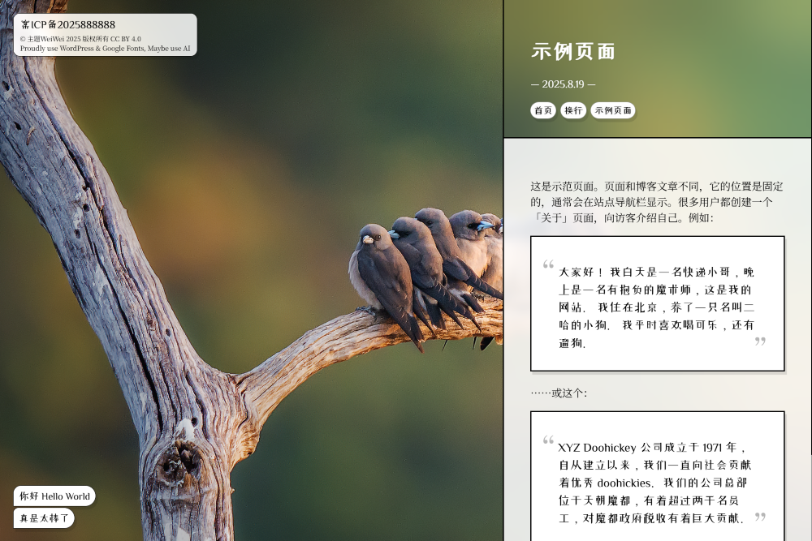
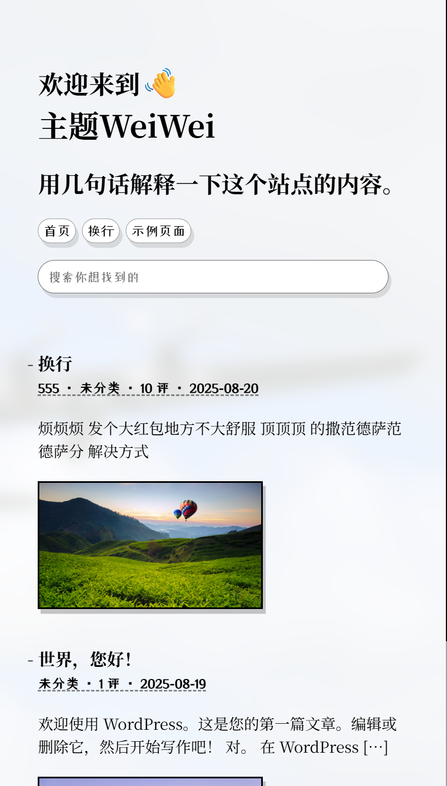
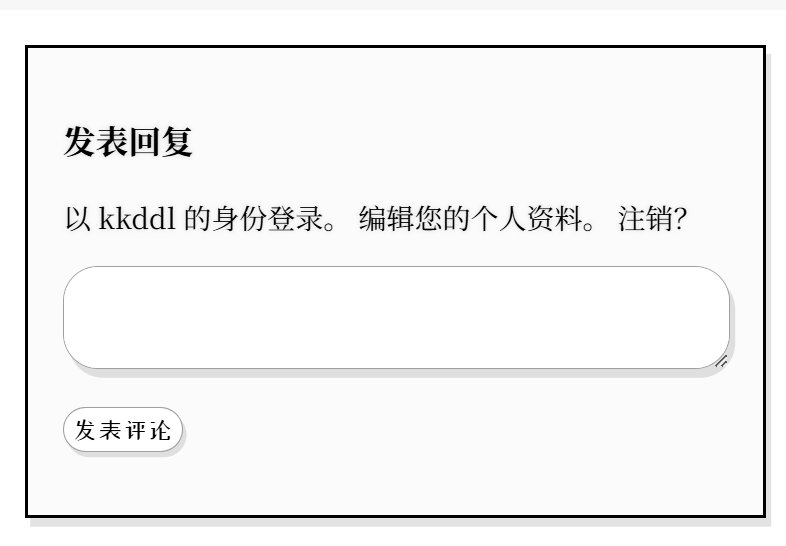

# WeiWei
A Wordpress Theme

A Wordpress Theme

I built this purely for fun, keeping everything clean and minimal. Thanks for checking it out!

本人完全是出于爱好，走的是极简风格，感谢支持。

## License

This theme is released under [CC BY 4.0](https://creativecommons.org/licenses/by/4.0/).  
You’re free to use, tweak, and share it—just make sure to give credit (author + license link).

许可证：本主题基于 [CC BY 4.0](https://creativecommons.org/licenses/by/4.0/) 发布。  您可以自由使用、修改和传播，但必须保留署名。  

## Install

### Option A — Download ZIP from GitHub (recommended)
### 方式 A —— 直接从 GitHub 下载 ZIP（推荐）

**EN**
1. Open the repository page on GitHub.
2. Click the green **Code** button → **Download ZIP**.
3. Do **not** unzip it.
4. In WordPress admin: **Appearance → Themes → Add New → Upload Theme**.
5. Click **Choose File**, select the downloaded `.zip`.
6. Click **Install Now**, then **Activate**.

**ZH**
1. 打开 GitHub 仓库页面。
2. 点击绿色 **Code** 按钮 → **Download ZIP**。
3. **不要**解压。
4. 登录 WordPress 后台：**外观 → 主题 → 安装主题 → 上传主题**。
5. 点击 **选择文件**，选中刚下载的 `.zip`。
6. 点击 **现在安装**，安装完成后 **启用**。

